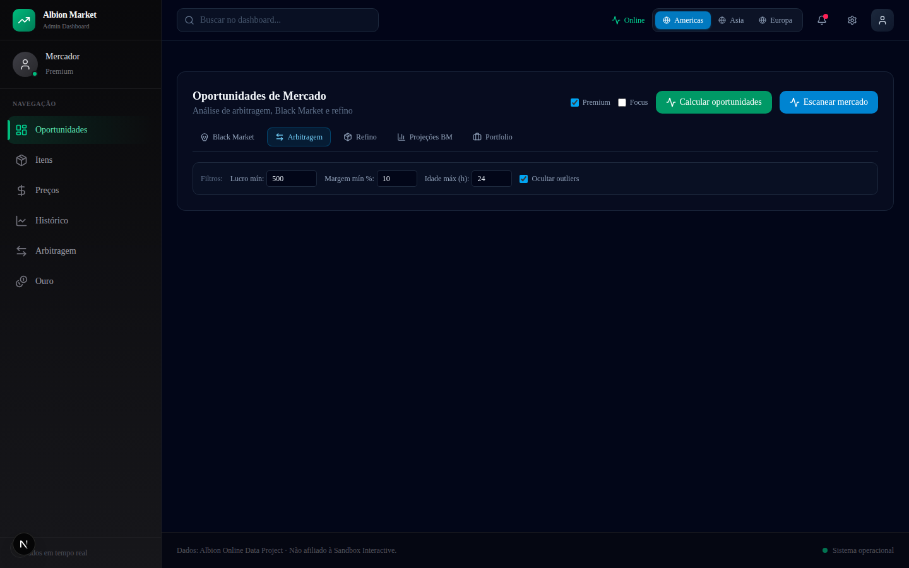

# Albion Market Analytics



> Dashboard full-stack para análise de mercado do Albion Online. Detecta oportunidades de arbitragem, refinamento e Black Market consumindo a API pública do Albion Online Data Project.

[](https://github.com/gitreginato/albion-market-analytics/actions/workflows/ci.yml)
[](https://opensource.org/licenses/MIT)
[](https://nodejs.org/)
[](https://www.typescriptlang.org/)
[](https://nextjs.org/)

**Demo ao vivo:** [link a ser adicionado após deploy no Vercel]

## O que aprendi

- **Proxy server-side para APIs públicas**: consumir a API do Albion server-side para evitar CORS, controlar cache com `s-maxage` e implementar rate-limit com retry e backoff exponencial.
- **Validação de input com Zod**: cada rota de API valida query params com schemas Zod tipados, retornando erros 400/502 padronizados. Allowlist, nunca denylist.
- **Observabilidade em rotas**: logs estruturados de latência e resultado em cada endpoint, permitindo identificar gargalos sem APM externo.
- **Testes em camadas**: testes unitários para lógica de negócio (oportunidades, refinamento, validação de preços) e testes de rota para cada endpoint da API.
- **SQLite como cache persistente**: usar better-sqlite3 para cache de scans e histórico de preços sem precisar de Postgres para um MVP.

## Funcionalidades

- **Painel de oportunidades**: detecta arbitragem entre cidades, flips no Black Market e lucro de refinamento com taxas reais do jogo.
- **Preços em tempo real**: proxy server-side para a API pública com cache, rate-limit e retry.
- **Histórico de preços**: série temporal por item/localização para identificar tendências.
- **Portfólio**: simulação de posições e projeção de lucro.
- **Busca de itens**: catálogo curado com autocomplete.
- **Observabilidade**: logs estruturados de latência e resultado em cada rota da API.
- **Multi-região**: suporta servidores West, East e Europe.

## Stack

| Camada | Tecnologia |
|--------|------------|
| Framework | Next.js 16 (App Router) |
| UI | React 19, Tailwind CSS v4, shadcn/ui, Recharts |
| Validação | Zod |
| Banco local | SQLite (better-sqlite3) |
| Testes | Vitest + jsdom + coverage v8 |
| Linguagem | TypeScript 5 |

## Arquitetura

```
src/
├── app/api/          # Rotas proxy (prices, opportunities, scan, history, gold, portfolio)
├── components/       # Componentes React do dashboard
├── lib/
│   ├── albion/       # Cliente da API, catálogo, oportunidades, refinamento, validação
│   ├── api/          # Observabilidade e parsing de parâmetros
│   ├── db/           # Repositório SQLite
│   └── store/        # Estado global do dashboard
```

- API pública consumida server-side para evitar CORS e controlar rate-limit.
- Cada rota valida query params com Zod e retorna erros 400/502 padronizados.
- Cache de curta duração nos endpoints de leitura (`Cache-Control: s-maxage=60`).
- SQLite usado para cache persistente de scans e histórico.

## Scripts

```bash
npm install
npm run dev          # servidor de desenvolvimento
npm run build        # build de produção
npm run test         # suite de testes (Vitest)
npm run test:coverage # cobertura
npm run lint         # ESLint
```

## Variáveis de ambiente

Copie `.env.example` para `.env` e ajuste se necessário.
O projeto funciona sem chaves de API (usa a API pública keyless do Albion Online Data Project).

## Testes

Vitest cobre:

- Cliente da API Albion (rate-limit, retry, batching).
- Cálculo de oportunidades (arbitragem, Black Market, refinamento).
- Validação de preços e detecção de outliers.
- Repositório SQLite e parâmetros de API.
- Rotas da API (health, prices, items/search, history, opportunities).

Execute com:

```bash
npm run test
```

## Requisitos

- **Node.js** >= 18
- **npm** >= 9
- Sistema operacional com suporte a `better-sqlite3` (Linux, macOS, Windows)

## Status

MVP funcional. Oportunidades de próximas fases: catálogo completo via `ao-bin-dumps`, alertas de preço e autenticação para persistência de portfólio.

## Como contribuir

1. Faça um fork do projeto
2. Crie uma branch para sua feature (`git checkout -b feature/nova-feature`)
3. Commit suas mudanças seguindo [Conventional Commits](https://www.conventionalcommits.org/)
4. Push para a branch (`git push origin feature/nova-feature`)
5. Abra um Pull Request

Certifique-se de que os testes passam antes de abrir o PR:

```bash
npm run test
npm run lint
```

## Troubleshooting

| Problema | Solução |
|----------|---------|
| `better-sqlite3` falha na instalação | Instale `python3 make g++` (`sudo apt install build-essential python3`) |
| Porta 3000 em uso | Use `PORT=3001 npm run dev` |
| Dados não carregam | Verifique conectividade com `https://www.albion-online-data.com` |
| DB corrompido | Delete `data/albion.db` e reinicie o servidor |

## Licença

[MIT](LICENSE) - Lucas, 2026
